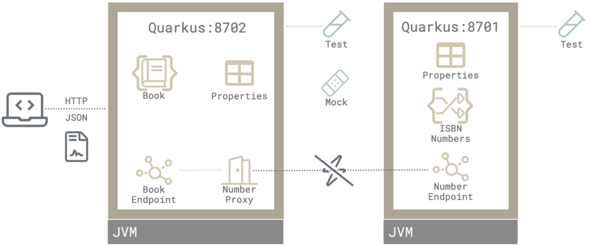

# Vintage Store Microservice

Este é um projeto de aprendizado para o Quarkus (https://quarkus.io/).

Arquitetura dos Micro Serviços:


## Execução

Para subir via Docker, primeiro é necessário construir cada projeto com o comando:
```
$ mvn package -Dquarkus.package.type=native -Dquarkus.native.container-build=true -Dquarkus.container-image.build=true
```

Executar via Docker Compose:

Na primeira vez: 
```
$ docker compose -f vintagestore-docker-compose.yaml up
```

Nas próximas vezes: 
```
$ docker compose -f vintagestore-docker-compose.yaml start
```

Parar com:
```
$ docker compose -f vintagestore-docker-compose.yaml stop
```

Remover os Containers com:
```
$ docker compose -f vintagestore-docker-compose.yaml down
```

Para usar:

1. Verificar a geração de Números de ISBN: 
```
$ curl http://localhost:8701/api/numbers
```

2. Para criar um livro: 
```
$ curl -X POST http://localhost:8702/api/books -d "titulo=Senhor dos Anéis&autor=JRR Tolkien&anoPublicacao=1966&genero=Fantasia"
```

## Documentação

Para subir qualquer Micro Serviço, nas pastas executar o comando:
```
$ mvn quarkus:dev
```

Mais informações ao iniciar os Microserviços em modo DEV, podem ser vistas em: 
- Number API: http://localhost:8701/q/dev-ui/welcome
- Book API: http://localhost:8702/q/dev-ui/welcome

O projeto também conta com OpenAPI e a documentação dos contratos podem ser acessadas por: 
- Number API: http://localhost:8701/q/swagger-ui/#/
- Book API: http://localhost:8702/q/swagger-ui/#/

